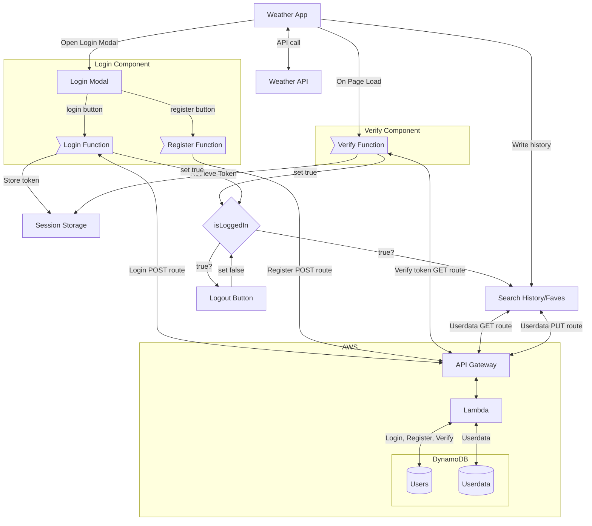

```mermaid
flowchart TD
    A[Login Modal]
    B>Verify Function]
    C[Weather App]
    D[API Gateway]
    E[Lambda]
    F[(Users)]
    G[(Userdata)]
    H>Login Function]
    I>Register Function]
    J[Session Storage]
    K{isLoggedIn}
    L[Search History/Faves]
    M[Logout Button]
    N[Weather API]


    A --> |login button| H
    H <--> |Login POST route| D
    A --> |register button| I
    I --> |Register POST route|D
    D <--> E
    E <--> |Login, Register, Verify| F
    H --> |Store token|J
    C --> |On Page Load| B
    B --> |Retrieve Token| J
    B --> |set true|K
    C --> |Open Login Modal| A
    K --> |true?|L & M
    C --> |Write history|L
    B <--> |Verify token GET route| D
    L <--> |Userdata GET route| D
    L <--> |Userdata PUT route| D
    E <--> |Userdata|G
    M --> |set false|K
    H --> |set true|K
    C <--> |API call|N

    subgraph Login Component
    A
    H
    I
    end
    
    subgraph Verify Component
    B
    end

    subgraph AWS

        subgraph DynamoDB
        F
        G
        end
    D
    E
    end
```